<p align="center">
  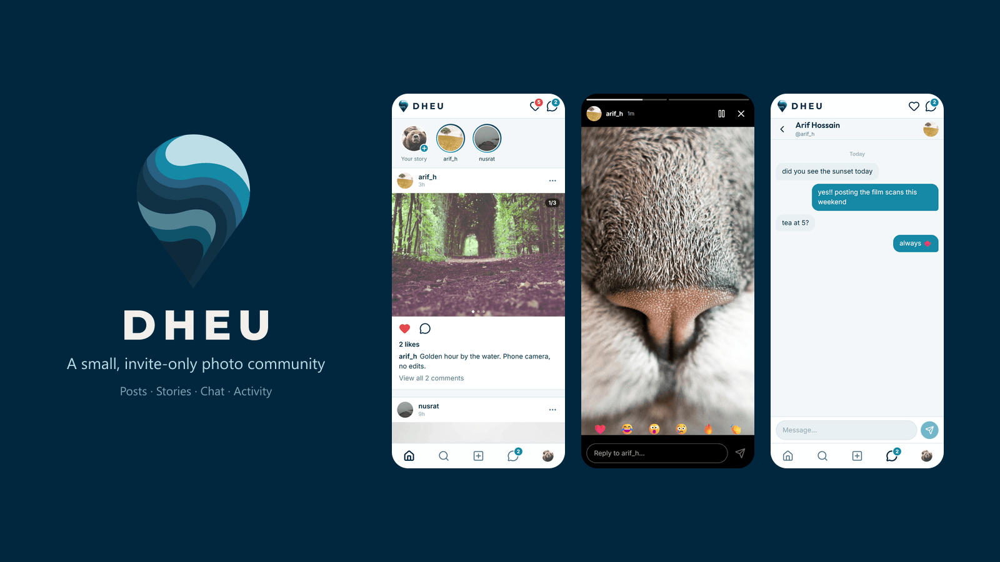
</p>

<h1 align="center">Dheu (ঢেউ)</h1>

<p align="center">
  An invite-only, Instagram-style photo community for a small circle of people.<br/>
  Still images only, posts that fade after 30 days, 24-hour stories, real-time chat — running entirely on free tiers.
</p>

<p align="center">
  <a href="https://dheu-beige.vercel.app"></a>
  
  
  
  
  
  
</p>

---

*Dheu* means **wave** in Bengali. It was built for one small community that wanted the feel of early Instagram — photos from friends, nothing else — without ads, algorithms, or an audience of strangers. Membership is by invite code only.

## Features

| | |
|---|---|
| **Posts** | 1–10 photos per post in a swipeable carousel, any aspect ratio, captions, likes (double-tap too), comments. Every post expires 30 days after it's shared. |
| **Stories** | 24-hour photo stories with a full-screen viewer (progress bars, tap / hold / swipe gestures, keyboard on desktop), emoji reactions, text replies that land in chat, "seen by" list, and permanent Highlights on the profile. |
| **Chat** | 1-to-1 messaging with instant delivery over WebSockets, unread badges, day separators and story-reply context. |
| **Activity** | Instagram-style alerts for likes, comments, new followers and story reactions — created by database triggers, shown with a live badge. |
| **Social graph** | Follow / unfollow, follower lists, people search, a chronological feed of the people you follow. |
| **Photos** | Resized to 1080 px in the browser before upload, HEIC → JPEG conversion, EXIF orientation applied, GPS and other metadata stripped. |
| **Accounts** | Email + password, invite-code gated sign-up, first account becomes admin, light / dark / system theme, installable as a home-screen app (PWA). |
| **Admin** | Invite codes with use limits and expiry, member suspension / password reset / deletion, content moderation, storage usage overview. |
| **Housekeeping** | A nightly job deletes expired posts, stories and old notifications together with their files. |

## Screenshots

<p align="center">
  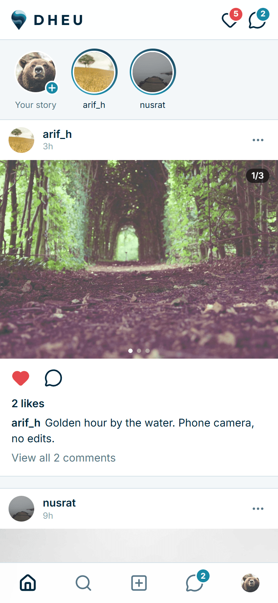
  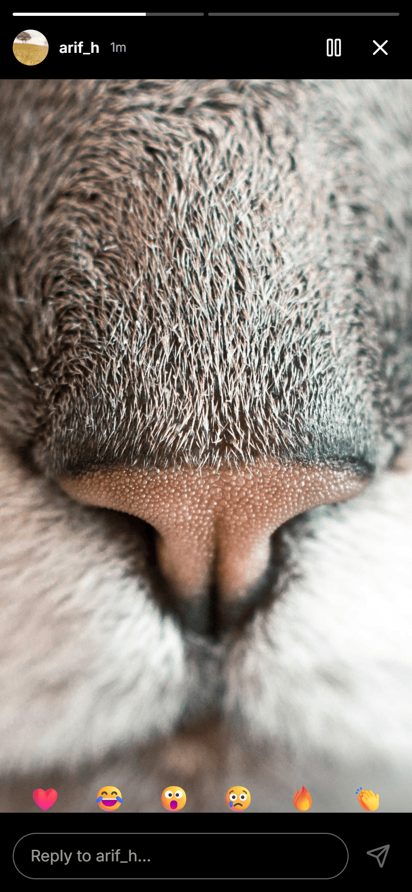
  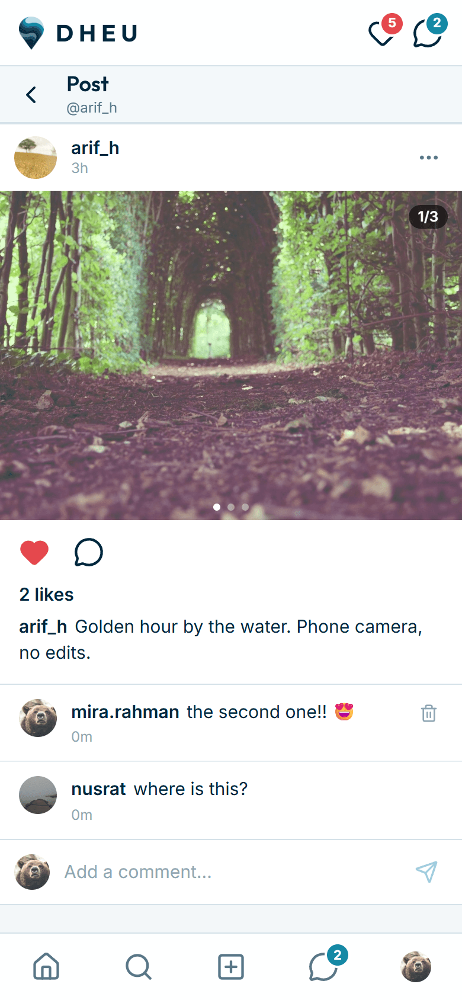
  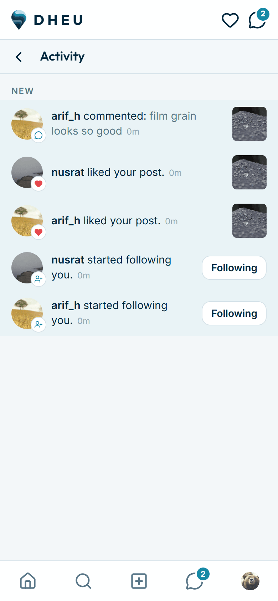
  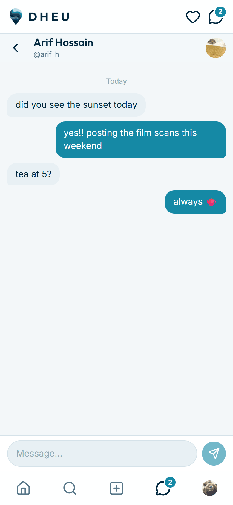
</p>
<p align="center">
  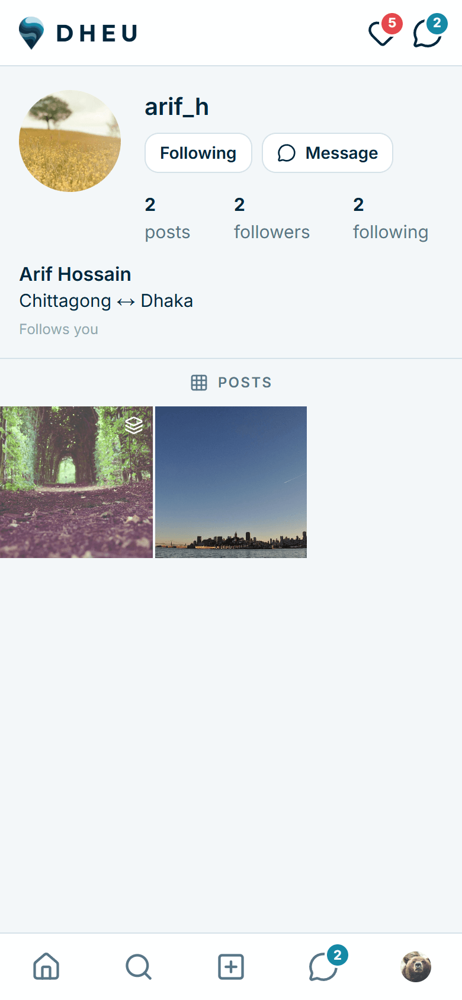
  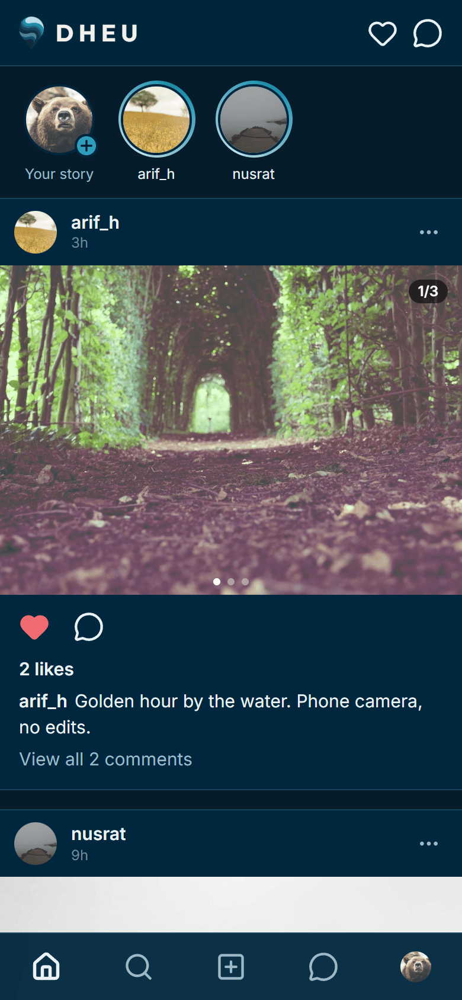
  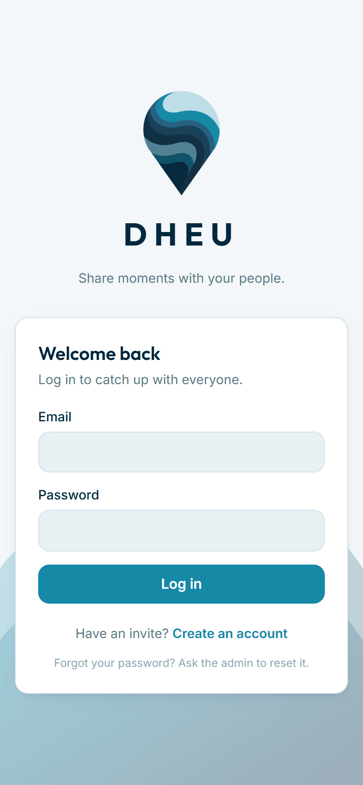
  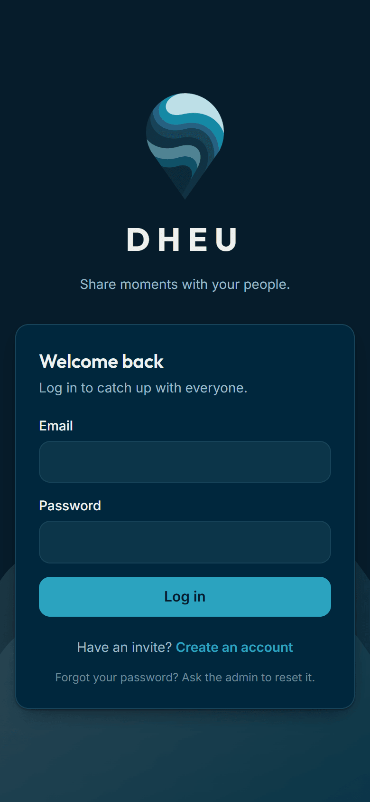
</p>
<p align="center">
  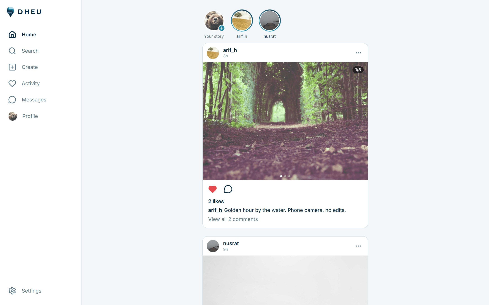
  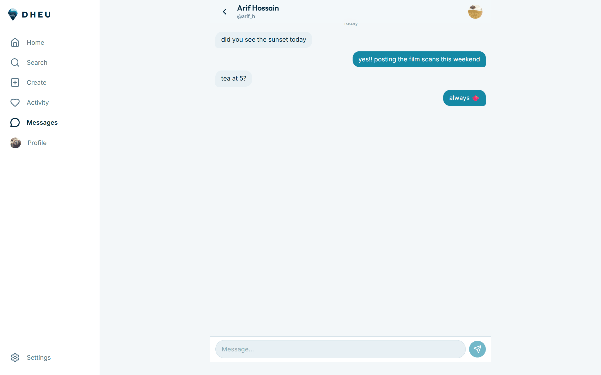
</p>

<sub>Demo accounts and stock photos; not real members.</sub>

## How it works

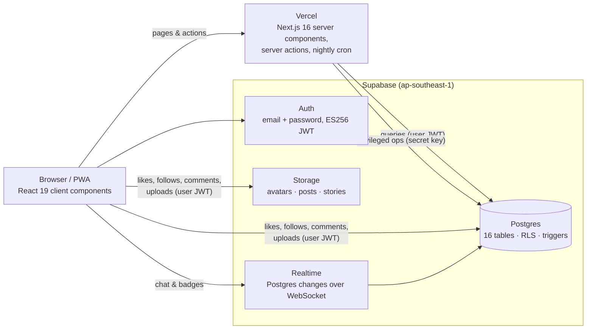

**One codebase, no separate backend.** Next.js server components render pages on Vercel and query Supabase directly; interactive pieces (feed, story viewer, chat, uploads) are client components that talk to Supabase from the browser.

**Security lives in the database.** Every table has Row Level Security — 47 policies evaluated inside Postgres against the caller's JWT. Members can only change their own rows, read chats they belong to, or touch the `read_at` column of their own notifications; the admin can delete anything. The browser only ever holds a publishable key that grants nothing on its own. Privileged operations (invite-gated sign-up, bans, cleanup) run server-side with the secret key.

**Notifications are triggers.** Inserting a like, follow, comment or story reaction fires a PL/pgSQL trigger that writes a notification row (and deletes it again on unlike / unfollow). Realtime streams the insert to the recipient's open tab.

**Images never touch a server.** The browser decodes the file (including HEIC via a WebAssembly build of libheif), fixes orientation, redraws it on a canvas at ≤ 1080 × 1920 — which also strips all metadata — and uploads the JPEG straight to Storage under `<userId>/<uuid>.jpg`. Storage policies only allow writes into your own folder.

**Expiry is a timestamp.** `posts.expires_at` defaults to `now() + 30 days`; RLS hides expired rows instantly and a Vercel cron job (`/api/cron/cleanup`) removes rows and files nightly, keeping highlighted stories.

## Stack

- **Next.js 16** (App Router, Turbopack, server actions, `proxy.ts` for session refresh) · **React 19** · **TypeScript** (strict; hand-written `Database` type mirrors the schema so every query is type-checked)
- **Tailwind CSS 4** with a small token set; light / dark themes; Inter + Outfit
- **Supabase**: Postgres, Auth, Storage, Realtime — schema and policies in [`supabase/migrations`](supabase/migrations)
- **Vercel** for hosting, functions pinned to the database's region, cron
- **zod** for input validation, **lucide-react** icons, **heic-to** for HEIC decoding

~6,500 lines of TypeScript, ~700 lines of SQL, nine runtime dependencies.

## Running it yourself

```bash
git clone https://github.com/brownfishsalman/Dheu.git
cd Dheu
npm install
cp .env.example .env.local   # fill in your Supabase URL + keys
npm run dev
```

Then create a free Supabase project, run the three files in `supabase/migrations/` in its SQL editor, and turn off "Confirm email" under Authentication. The first account to sign up becomes the admin. Full step-by-step instructions — including deploying to Vercel and day-to-day administration — are in the [owner's guide](docs/OWNER-GUIDE.md).

## Project layout

```
src/app/(auth)/            login & sign-up (server actions)
src/app/(app)/             everything behind login: feed, profiles, posts, stories,
                           highlights, messages, activity, settings, admin
src/app/api/cron/cleanup/  nightly expiry job
src/proxy.ts               session refresh + login gate (runs on every request)
src/components/            UI: post/ story/ chat/ activity/ profile/ admin/ nav/ ui/ brand/
src/lib/data/              server-only query functions
src/lib/supabase/          browser / server / admin clients, realtime auth helper
src/lib/images.ts          browser-side image pipeline
supabase/migrations/       schema, RLS policies, triggers, storage buckets
scripts/build-logo.mjs     regenerates icons from the original logo artwork
```

## Design notes

- **Free-tier first.** 50 members, 1 GB of images. Resizing to 1080 px and expiring posts after 30 days keeps storage flat.
- **Public-read image URLs.** Files sit at unguessable paths in public buckets instead of signing every URL; a deliberate trade-off for simplicity in a trusted community.
- **No email.** Free-tier SMTP can't reach arbitrary addresses, so sign-up needs no confirmation and password resets go through the admin.
- **Region matters.** Moving Vercel's functions next to the database cut page render time by roughly 4× — see `vercel.json`.

## License

[MIT](LICENSE) © Salman Saadiq. The logo and the name *Dheu* are not covered by the licence.
